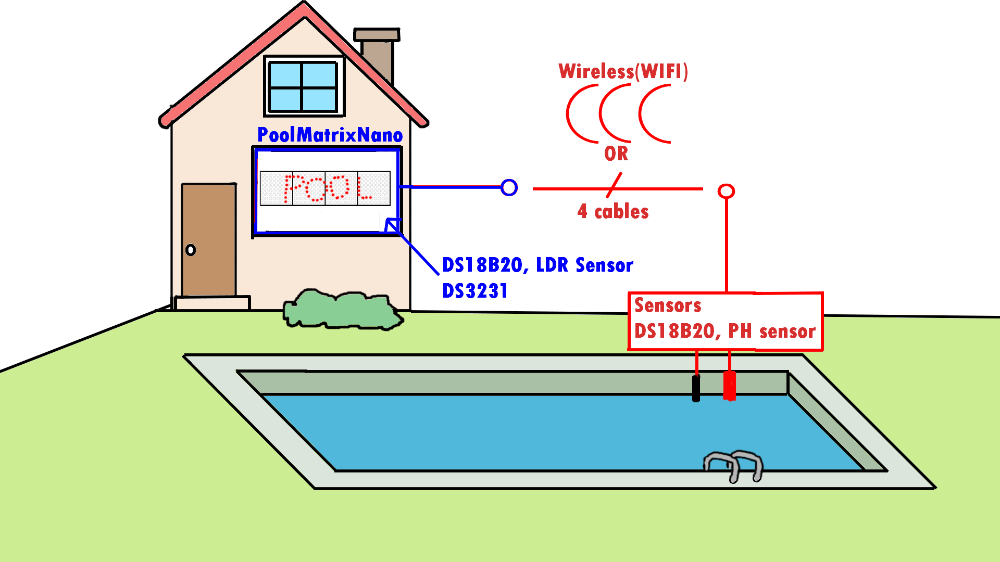
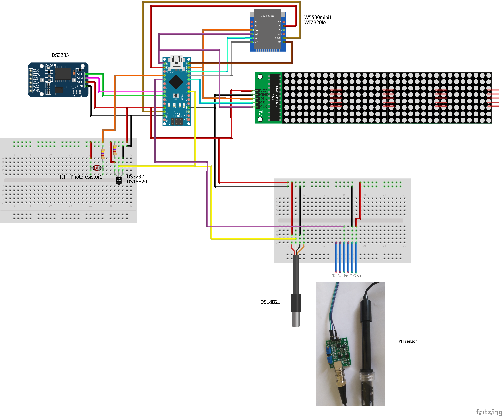

# Pool-Matrix-Monitor

**Simple arduino pool clock with sensors**

  

Pool-Matrix-Monitor is pool clock with temperature, ph sensor and all this data send to ThingSpeak, or GET to server.

# Main Features
  * [x] Matrix display in cycle(TIME,"Outsite",OUTSITE_TEMPERATURE,"Pool",POOL_TEMPERATURE,"PH sensor", POOL_PH)
  * [x] Measurement of Sensors light, temperature, ph 
  * [x] Auto detection connected sensors
  * [x] Auto correct summer and standart time (DST correct)

# Hardware Versions
|  HW Versions  | MCU | transfer type pool sensor | SW release | HW release |  Approximate price  |
| :--------: |:---:| :-----------------------: | :--------: | :--------: | :-----------------: |
| PoolMatrixNano | Arduino nano | cable | Not realesed | Not realesed | ~13$ |
| PoolMatrixNanoEth | Arduino nano | cable | Not realesed | Not realesed |  |
| PoolMatrixESP32 | ESP32 | cable OR WIFI | Not realesed | Not realesed |  |
| PoolMatrixESP8266 | ESP8266 | cable OR WIFI | Not realesed | Not realesed | |

## PoolMatrixNano
**Basic**
  * Arduino nano
  * DS3231
  * MAX7219 Matrix LED Display Module 4-v-1
  * some resistors
  
**Optional**
  * DS18B20 *- temperature sensor*
  * Photo Resistor
  * PH sensor PH-4502C 
    
**Schematic**
|  Arduino  |   |  Modules  |
| :-------: |---|  :------: |
| D13(SCK) | -> |  MATRIX(CLK) |
| D11(MOSI) | -> |  MATRIX(DIN) |
| D10(SS) | -> | MATRIX(CS) |
| D5(PWM) | -> | DS18B20 |
| A5(SCL) | -> | DS3231(SCL) |
| A4(SDA) | -> | DS3231(SDA) |
| A1 | -> | PH sensor |
| A0 | -> | Photo resistor(LUX meter) |

# Installation
 * Download below library and upload code with Arduino IDE to arduino nano. Code is saved in **src/...** you can choose more version(no ethernet, etc.).
 
 **PS: In this time isn'nt code uploaded :) . In early time will be upload.**
 
**Library**
  * [MD_MAX72xx](https://github.com/MajicDesigns/MD_MAX72XX) - *from MajicDesigns*
  * [RTClib](https://github.com/adafruit/RTClib) - *from adafruit*
  * [DallasTemperature](https://github.com/milesburton/Arduino-Temperature-Control-Library) - *from milesburton*
  * [Ethernet2](https://github.com/adafruit/Ethernet2) - *from adafruit*
  * [DST_RTC](https://github.com/andydoro/DST_RTC) - *from andydoro*  

# PCB
  **Pcb are preparing**

## Planned Features
  * [ ] send data to database (MYSQL), ThingSpeak
  * [ ] ESP8266/ESP32 version
  * [x] NTP synchronize time
  
## Support
Project is supported if you have any problem contact me.
