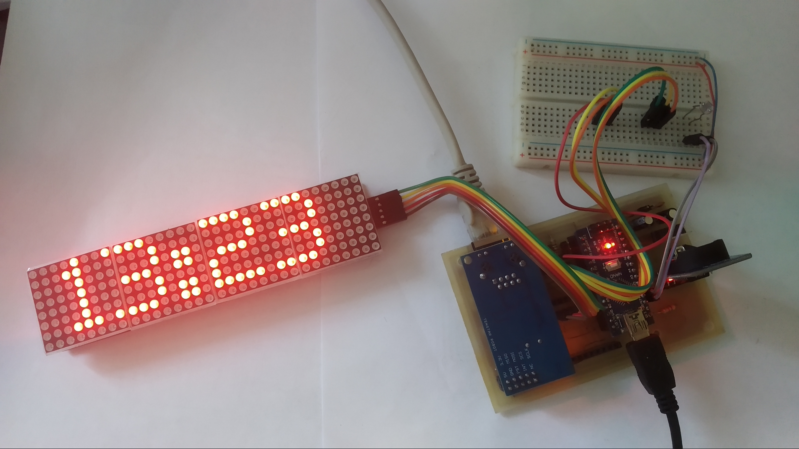

# Pool-Matrix-Monitor

**Simple arduino pool clock with sensors**

  

Pool-Matrix-Monitor is pool clock with temperature, ph sensor and all this data send to ThingSpeak, or GET to server.

# Main Features
  * [x] Matrix display in cycle(TIME,"Outsite",OUTSITE_TEMPERATURE,"Pool",POOL_TEMPERATURE,"PH sensor", POOL_PH)
  * [x] Measurement of Sensors light, temperature, ph
  * [x] Auto detection connected sensors
  * [x] Auto correct summer and standart time (DST correct)

# How to use?
  **1.** Choose Optimal Board version. Project is saved in **__NAME_OF_BOARD__/...** (example **PoolMatrixNano/...**)  
  **2.** Create circuit or pcb  
  **3.** Upload Arduino Software with Arduino IDE  
  **4.** Put sensors in conectors and you can put in box  

  **[Full Tutorial in CZ language here](boards.md#poolmatrixnano)**

# Boards Versions
I have prepering more version of this project so you can choose which is best for you.

|  Boards Versions  | MCU | transfer type pool sensor | SW release | HW release |  Price  |
| :--------: |:---:| :-----------------------: | :--------: | :--------: | :-----------------: |
| [PoolMatrixNano](#poolmatrixnano) | Arduino nano | cable | PMN-v1.0 | PMN-v1.1H | ~13$ |
| PoolMatrixNanoEth | Arduino nano | cable | Not realesed | Not realesed |  |
| PoolMatrixESP32 | ESP32 | cable OR WIFI | Not realesed | Not realesed |  |
| PoolMatrixESP8266 | ESP8266 | cable OR WIFI | Not realesed | Not realesed | |

**for more info with tutorial go to section [All Boards list](boards.md)**

## PoolMatrixNano [[Full version](boards.md#poolmatrixnano)]
**Offline board arduino nano mcu with rtc, matrix display and sensors. Simple cheap and easy for home pool.**

**Basic**
  * Arduino nano
  * DS3231
  * MAX7219 Matrix LED Display Module 4-v-1
  * some resistors

**Optional**
  * DS18B20 *- temperature sensor*
  * Photo Resistor
  * PH sensor PH-4502C

# PCB
  I designed PCB oneside only with some proclaim wires :). So, you can easily create in home or you can solder on prototype pcb. PCB is saved in **__NAME_OF_BOARD__/pcb/** you can choose more version(no ethernet, etc.).

  **PS: In this time you can choose only PoolMatrixNano**

# Installation
 * Download below library and upload code with Arduino IDE to arduino nano. Code is saved in **__NAME_OF_BOARD__/src/** you can choose more version(no ethernet, etc.).

 **In MD_Parola library you must to disable all advance function for a smaller size.**

 **PS: In this time you can choose only PoolMatrixNano**

**Library**
  * [MD_MAX72xx](https://github.com/MajicDesigns/MD_MAX72XX) - *from MajicDesigns*
  * [RTClib](https://github.com/adafruit/RTClib) - *from adafruit*
  * [DallasTemperature](https://github.com/milesburton/Arduino-Temperature-Control-Library) - *from milesburton*
  * [Ethernet2](https://github.com/adafruit/Ethernet2) - *from adafruit*
  * [DST_RTC](https://github.com/andydoro/DST_RTC) - *from andydoro*  

## Planned Features
  * [ ] send data to database (MYSQL), ThingSpeak
  * [ ] ESP8266/ESP32 version
  * [x] NTP synchronize time

## Support
Project is supported if you have any problem contact me. Please give me a :star: if you like my project. If you have any problem feel free and contact me.
