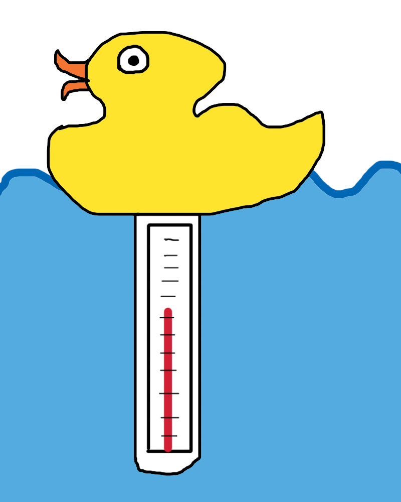
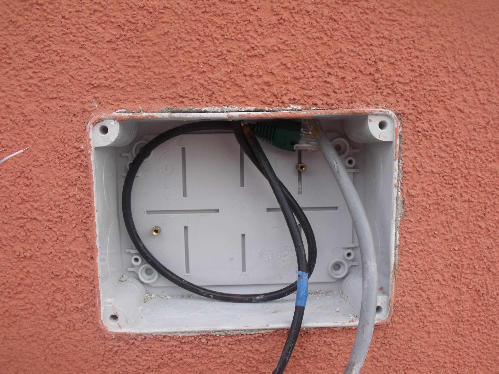
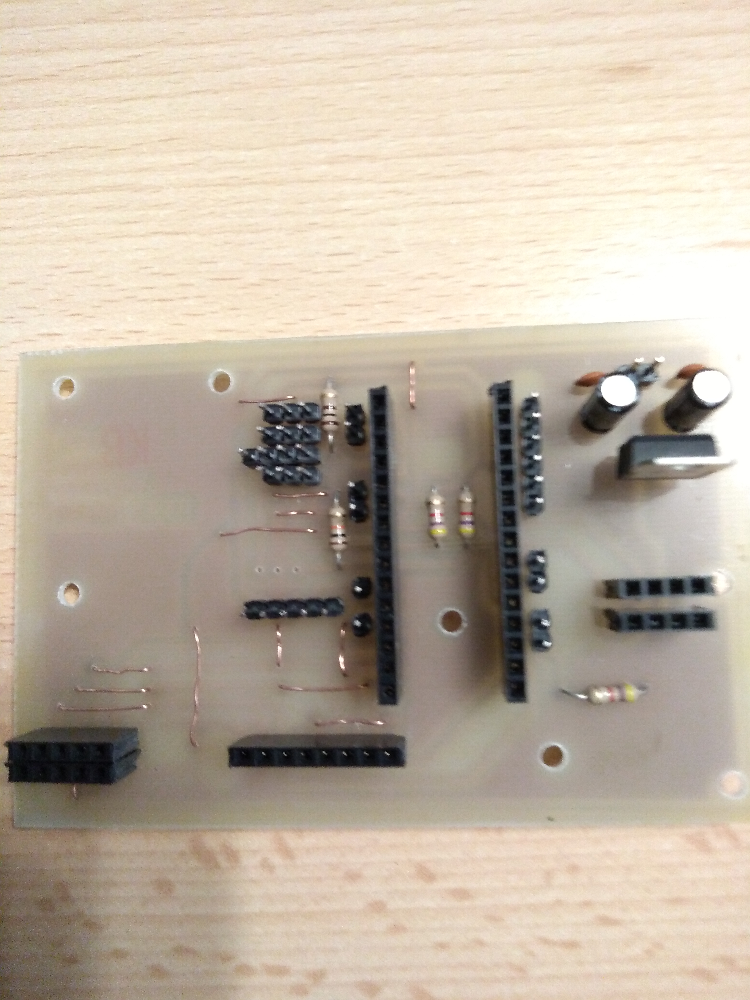
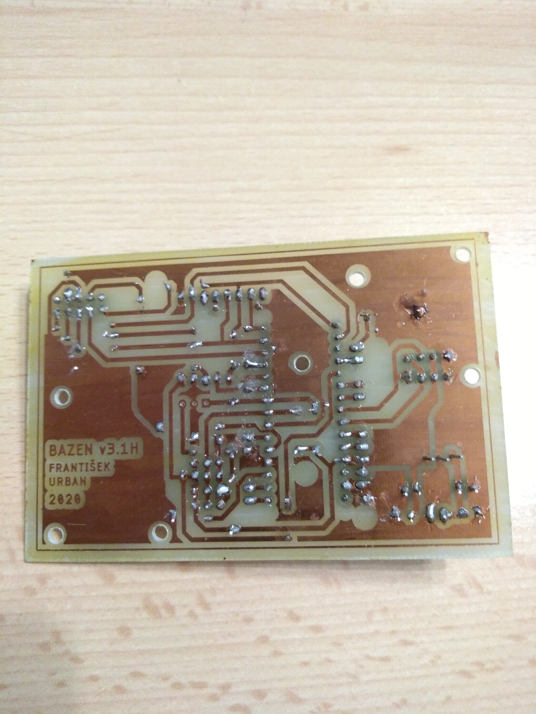
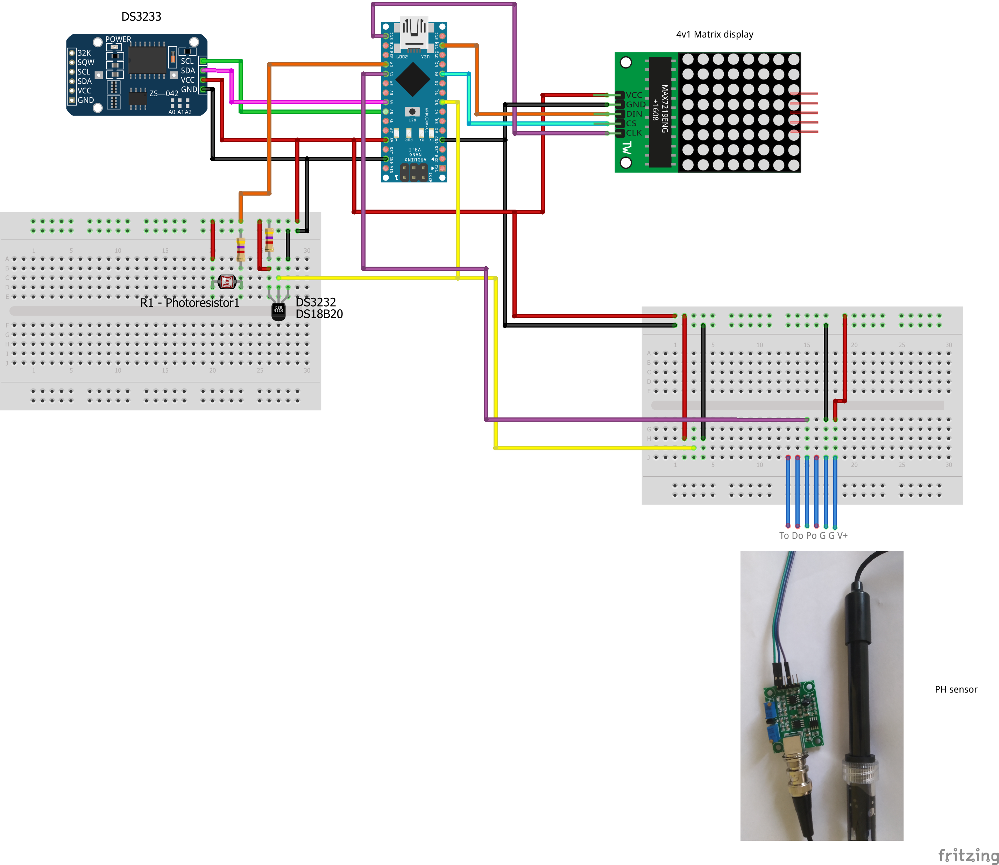
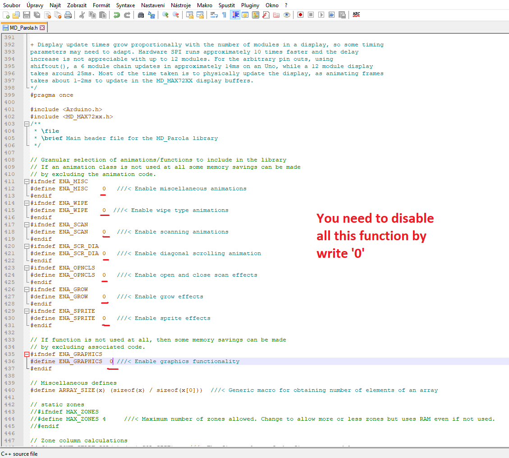
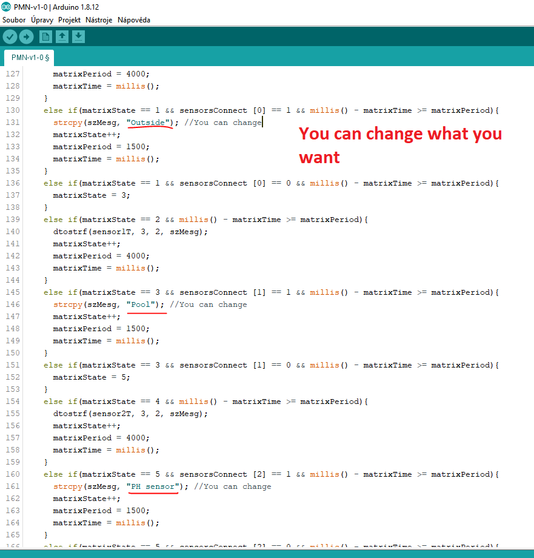

# Tutorial Pool-Matrix-Monitor
  

## Úvod
Zdavím, nápad udělat si vlastní teploměr k bazénu mě napadl po používání teploměru "zvířátka". Tento teploměr je velký, ale hlavně musíte šahat do vody, pokud chcete znát teplotu. Proto mě napadl nápad udělat si vlastní hodiny s teploměrem, který bude měřit venkovní a bazénovou teplotu. Inspiraci na displej jsem vzal z průmyslových hodin teploměrů, které se používají na plaveckém bazénu

  

*teploměr zvířátka, prumyslove bazenove hodiny*
*(kresleno kvuli copyrightu)*

Myšlenkou tedy bylo vyrobit hodiny s teploměrem a vše zobrazovat na displeji. Jako displej jsem zvolil maticový displej, konkrétně se 4 maticovými moduly. Dalo by se sice asi využít segmisegmentovku s pár diodami, ale tohle se mi zdá jednoduší na výrobu. Obvod řídí Arduino nano a čas zaznamenává RTC modul DS3231. Tento projekt měří venkovní a bazénovou teplotu, pro měření jsou použity sensory DS18B20. pro venkovní je použita verze s pouzdrem TO92 a v bazénu je použita vodotěsná verze. Takže to jsou všechny hlavní součásky, nepočítám do toho resistory a konektory. Protože jsem použil čínské moduly dostal jsem se na cenu cca ~300kč (bez krabičky).

## 0. Možnosti Bazénu
Pokud si tedy chcete vyrobit taky takové hodiny s teploměrem. Doporučuji vám si před tím určit, kam chcete displej umístit, a kam umístíte do bazénu teploměr. K Bazénovému temploměru je nutné přivést 3 dráty od arduina (+5V, GND, DigitalPin). K samotnému displeji je potřeba přivéct dráty pro napájení (+5V,GND).

   

*Foto mého řešení krabičky a sensoru u bazénu*

K napájení je nutné použít 5V. Napájení přes VIN konektor podle mě není možný kvůli vyššímu proudu, který by způsobil spálení stabilizátoru na desce arduino nano. I když je možné, že pokud to budete napájet přes VIN třeba 7V, že to bude fungovat nemám to však odzkoušené.

## 1. Deska plošného spoje (Obvod)
Protože mám doma možnost vyrábět jednostranné DPS, tak jsem navrhl jednostranou desku s pár "proklemováky" (nevim jak se tomu na DPS říká asi nijak prostě místo druhé vrstvy to propojím drátkem). Protože je tohle, ale tutoriál a ne všichni mají možnost vyrobit si DPS. Je zde možnost zapojit to na prototype board, nebo rovnou připájet moduly a součástky k sobě. (případně pokud si chcete projekt pouze vyzkoušet na breadboard). Pokud tedy nechcete vyrábět DPS přejděte na část 1.2

  

*ukázka trochu jiné verze DPS*

Pokud jste se rozhodli vyrobit si DPS použijte svoji oblíbenou metodu, já znám 3 a všechny jsem vyzkoušel(+1 kterou jsem nezkoušel). První metoda se jmenuje "Toner transfer" tato metoda spočívá v přenosu toneru z papíru na DPS a následné vyleptání. Mě se však tato metoda vůbec neosvětčila. Proto bych doporučil metodu 2. Druhá metoda spočívá v přenosu obvodu pomocí photocitlivé vrstvy na DPS, k tomu jsou nutné DPS s nanesenou vrstvou. Obvod se vytiskne na fólie a přenese přes UV záření, které vysvítí vrstvu na desce. Další metody jsou přes "Uv Dry Film"(stejná jako 2 metoda s tím že není vrstva nanesena ale musíme ji nanést), CNC frézou.

*Projekt je uložen v adresáři **/PoolMatrixNano/** Deska je pak uložena ve složce pcb*

 

*Positiv a negativ DPS*

## 1.1 Seznam Součástek
|  Součástka  | Počet |  Cena  |
| :---------: | :---: |  ---: |
|  **Základní**  |    |
|  Arduino nano  | 1 | 43Kč |
|  RTC DS3231  | 1 | 25Kč |
|  MAX7219 Matrix LED Display Module 4-v-1  | 1 | 72Kč |
|  dioda 1N4007  | 1 | 1Kč |
|  resistor 4K7  | 2 | 1Kč |
|  **Volitelné**  |    |
|  DS18B20 TO92  | 1 | 20Kč |
|  DS18B20 WaterProof | 1 | 22Kč |
|  Photo resistor  | 1 | 1Kč |
|  Pinheaders  | 1 | 48Kč |
|  **Cena základní**  || 142Kč |
|  **Cena maximální**  || 233Kč |

*Ceny jsou orientační a nejsou včetně poštovného*

*Ukázka mojí prototypové desky s ethernetem*

## 1.2 Zapojení schéma
|  Arduino  |   |  Modules  |
| :-------: |:-:|  :------: |
| D13(SCK) | -> |  MATRIX(CLK) |
| D11(MOSI) | -> |  MATRIX(DIN) |
| D10(SS) | -> | MATRIX(CS) |
| D5(PWM) | -> | DS18B20 |
| A5(SCL) | -> | DS3231(SCL) |
| A4(SDA) | -> | DS3231(SDA) |
| A1 | -> | PH sensor |
| A0 | -> | Photo resistor(LUX meter) |

## 2. Nahrání Softwaru
Software se nahraje v Arduino IDE, přes usb do arduino nano. Potřebný kód je ve složce **/PoolMatrixNano/arduino-code**. V programu je i příprava na PH sensor (která není zahrnuta do kodu), ale zřejmě jej nedodělám protože je docela nepřesný a drahý. Aby jste byly schopný nahrát kód je nutné stáhnout knihovny níže. V knihovně MD_Parola musíte vypnou nadstadardní funkce viz foto (jinak by se program nevešel na arduino nano).

**V MD_Parola library musíte  vypnout nadstadardní funkce**

Zde jsi můžete přenastavit text, který se zobrazuje na maticovce

**Library**
 * [MD_MAX72xx](https://github.com/MajicDesigns/MD_MAX72XX) - *from MajicDesigns*
 * [RTClib](https://github.com/adafruit/RTClib) - *from adafruit*
 * [DallasTemperature](https://github.com/milesburton/Arduino-Temperature-Control-Library) - *from milesburton*
 * [Ethernet2](https://github.com/adafruit/Ethernet2) - *from adafruit*
 * [DST_RTC](https://github.com/andydoro/DST_RTC) - *from andydoro*  

*Projekt je uložen v adresáři **/PoolMatrixNano/** Deska je pak uložena ve složce arduino-code*

## Závěr
Tak to jsou moje hodiny k bazénu. Pokud se vám tutoriál a projekt líbil dejte :star: na můj projekt na GitHubu. Pokud by jste měli nějaké problémy, nebo pokud je v programu nebo v HW chyba neváhejte mě kontaktovat. Projekt hodlám ještě vytvořit na ESP32 a připojit ho tak k internetu.
