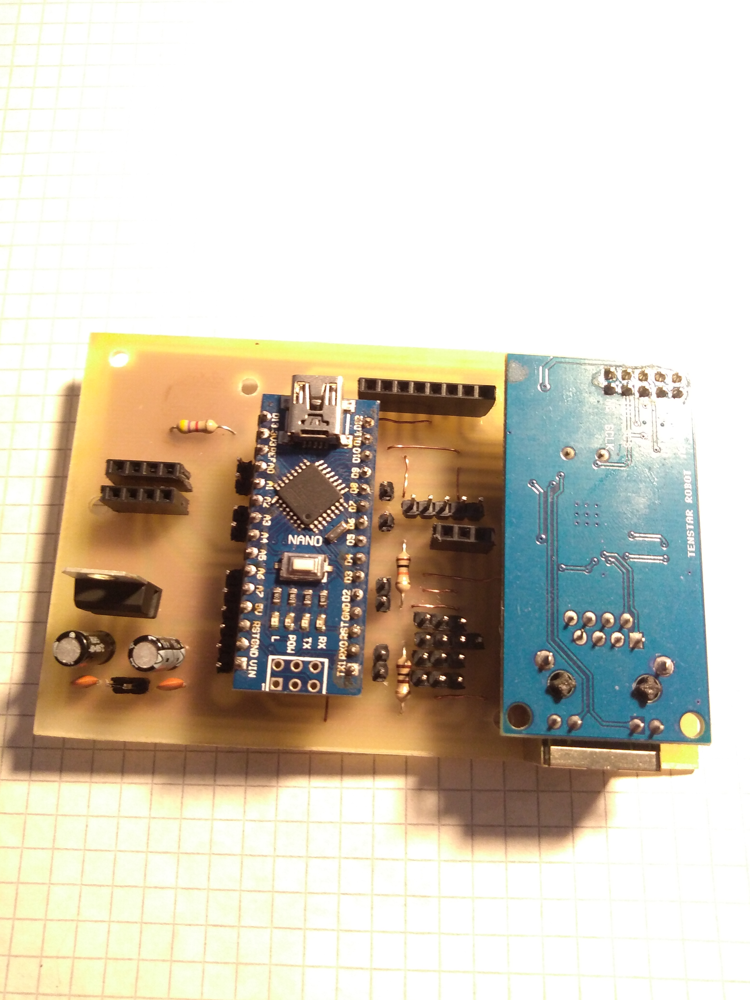

# Boards Versions
|  Board Versions  | MCU | transfer type pool sensor | SW release | HW release |  Approximate price  |
| :--------: |:---:| :-----------------------: | :--------: | :--------: | :-----------------: |
|[PoolMatrixNano](#poolmatrixnano)  | Arduino nano | cable | PMN-v1.1H | PMN-v1.0 | ~13$ |
| PoolMatrixNanoEth | Arduino nano | cable | Not realesed | Not realesed |  |
| PoolMatrixESP32 | ESP32 | cable OR WIFI | Not realesed | Not realesed |  |
| PoolMatrixESP8266 | ESP8266 | cable OR WIFI | Not realesed | Not realesed | |

# PoolMatrixNano
 

Offline arduino nano mcu with rtc, matrix display and sensors. Simple cheap and easy for home pool.

## Components
**Basic**
  * Arduino nano
  * DS3231
  * MAX7219 Matrix LED Display Module 4-v-1
  * some resistors
  
**Optional**
  * DS18B20 *- temperature sensor*
  * Photo Resistor
  * PH sensor PH-4502C 
    
## Schematic
|  Arduino  |   |  Modules  |
| :-------: |---|  :------: |
| D13(SCK) | -> |  MATRIX(CLK) |
| D11(MOSI) | -> |  MATRIX(DIN) |
| D10(SS) | -> | MATRIX(CS) |
| D5(PWM) | -> | DS18B20 |
| A5(SCL) | -> | DS3231(SCL) |
| A4(SDA) | -> | DS3231(SDA) |
| A1 | -> | PH sensor |
| A0 | -> | Photo resistor(LUX meter) |

## PCB
I designed PCB oneside only with some proclaim wires :). So, you can easily create in home or you can solder on prototype pcb. PCB is saved in **pcb/...** you can choose more version(no ethernet, etc.).

## Tutorial
First, it is important to engage the schematic. You can plug it into a breadboard or use my pcb design. It is also possible to connect a circuit to a prototype pcb if you do not have the ability to produce a pcb. PCB is saved in **pcb/...** you can choose more version(no ethernet, etc.).

If you do not want any sum in the optional section, you do not need to use it. The code will work. So if you don't want a ph sensor, you don't have to connect it. 

**So far, I do not recommend using a ph sensor too much, because it seems inaccurate and expensive.**

After you complete HW section. You can upload code with Arduino IDE(must download all library). Code is saved in **src/...** you can choose more version(no ethernet, etc.).

**In *MD_Parola* library you must to disable all advance function for a smaller size.**

And your pool-matrix-monitor is done. You can test it and choose in some nice box.

if you have any problems feel free to contact me.
